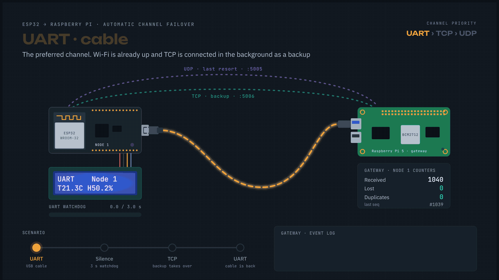
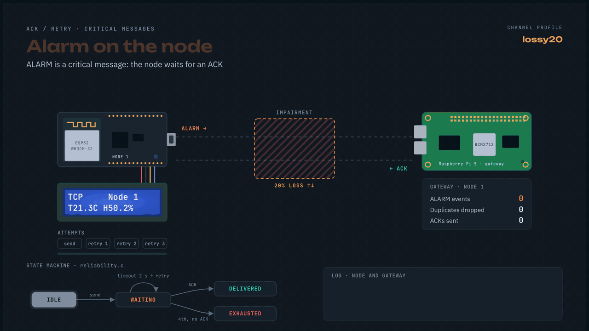
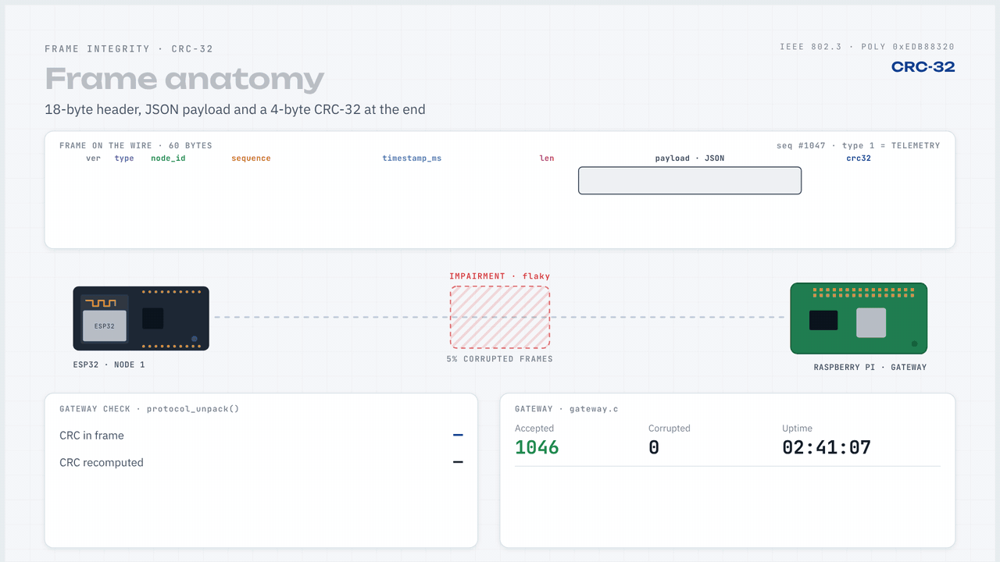
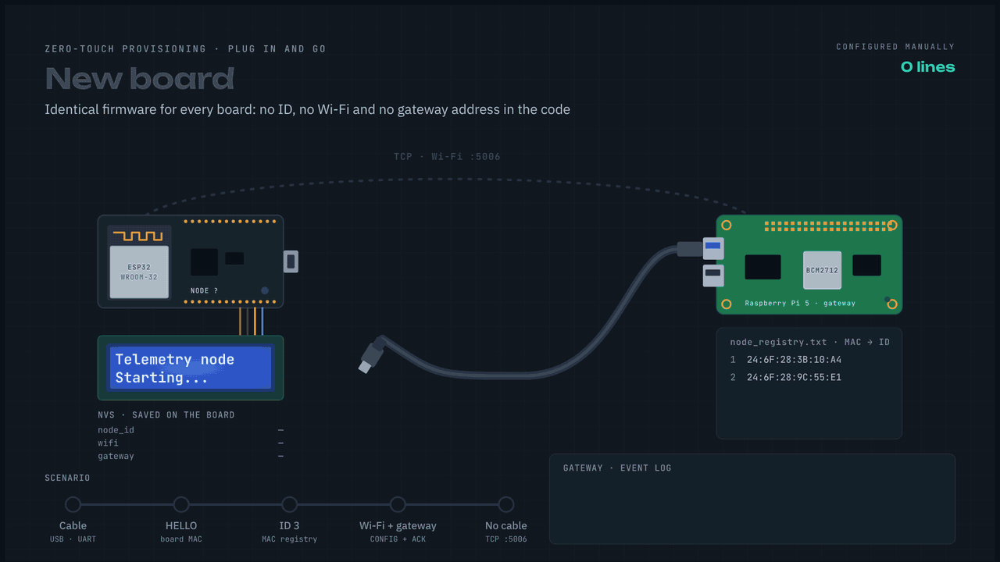
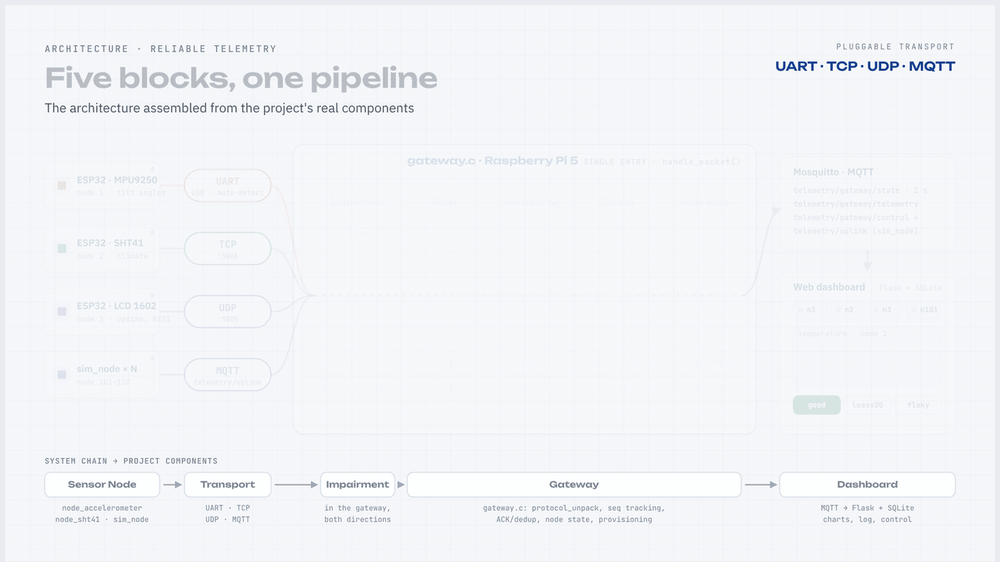
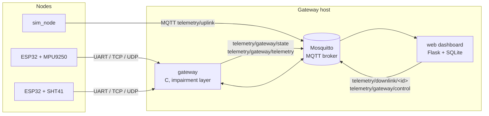

# Reliable Telemetry

**Telemetry that survives bad links.** ESP32 sensor nodes stream data to a C gateway over UART, TCP or UDP, buffer
locally when every link is down, and deliver critical events with acknowledgement and retransmission. A built-in channel
impairment simulator lets you break the network on purpose and watch the guarantees hold.

[](https://github.com/Gilganesh/reliable-telemetry-protocol/actions/workflows/ci.yml)
[](LICENSE)




Unplug the cable and the node notices within 3 seconds, moves to Wi-Fi and keeps streaming. Nothing is lost silently:
the gateway sees the gap, the node buffers what it could not send, and the dashboard fills the hole in once the data
arrives.

## Why

Most hobby telemetry is fire-and-forget: when Wi-Fi drops, readings vanish and nobody knows. This project is a small,
readable reference for doing it properly on real hardware: a compact binary protocol, a store-and-forward buffer, an
at-least-once delivery path for alarms, sequence tracking that tells duplicates from late packets, and tooling to prove it
works instead of just claiming it.

## Features

- **Compact binary protocol**: 18-byte header, JSON payload up to 128 bytes, CRC-32 over every frame.
- **Swappable transports**: the same protocol logic runs over UART, TCP, UDP and MQTT. Nodes pick the best link
  automatically (UART > TCP > UDP) and fail over without losing sequence continuity.
- **Store-and-forward**: nodes buffer telemetry while no link is alive and flush it in order once a link returns.
  Critical messages wait in a separate queue and are never evicted by telemetry.
- **At-least-once delivery for critical messages**: ALARM and CONFIG frames are acknowledged and retried
  (2 s timeout, 3 retries) with byte-identical retransmissions.
- **Loss, duplicate and reordering detection**: a per-node sliding window over sequence numbers; duplicates never
  create a second event, late packets are accounted for correctly.
- **Zero-touch provisioning**: a board plugged into the gateway over UART receives its node id, Wi-Fi credentials
  and gateway address automatically and can then work over Wi-Fi alone.
- **Link quality metrics**: online/offline state, loss rate, round-trip latency, node-side buffer backlog.
- **Honest time axis**: the gateway reconstructs when each sample was actually measured, so telemetry buffered
  during an outage lands at its true time on the charts.
- **Channel impairment simulator**: profiles (`good`, `lossy20`, `delay`, `flaky`), timed blackouts, per-node targeting
  and reproducible runs via a seed, all controllable from the dashboard.
- **Web dashboard**: live node cards, KPIs, time-series charts backed by SQLite, alarm log, remote commands.
- **No hardware needed to try it**: simulated nodes speak the same protocol over MQTT.

### Reliable delivery of critical events

An ALARM is sent, then retried every 2 seconds until it is acknowledged. The gateway recognises a retry by its sequence
number: it acknowledges again but records the event once.



### Corrupted frames are rejected

Every frame carries a CRC-32. The gateway recomputes it on arrival; a damaged frame is dropped, counted, and never
reaches the dashboard.



### Plug in and go

A new board announces its MAC address over UART. The gateway assigns it an id, sends the Wi-Fi settings and its own
address, and the board keeps working over Wi-Fi without the cable.



## Architecture



The gateway is the single source of truth: it validates frames, tracks sequence numbers, sends ACKs over the same link a
frame arrived on, and publishes its processed state. The web application only renders that state and stores sensor
samples; it never recomputes delivery statistics on its own.

<details>
<summary>Diagram</summary>



</details>

## The three blocks

| Block | Folder | What it is | How to start |
|---|---|---|---|
| **Gateway** | [`gateway/`](gateway/) | C daemon that receives frames from every node, acknowledges, tracks and publishes state | `./run.sh` builds and starts it |
| **Node** | [`node/`](node/) | ESP32 firmware: pick one variant. A simulated node is included | upload a sketch, or run `node/simulated/sim_node` |
| **Web** | [`web/`](web/) | Flask dashboard with charts, alarms and impairment controls | started by `./run.sh`, open <http://localhost:8080> or `http://<gateway-ip>:8080` from any computer on the same network |

Everything else supports these three: `protocol/` (the shared codec), `docs/`, `tests/` and `scripts/`.

**Where each block runs**

| Block | Runs on |
|---|---|
| Gateway and web server | Raspberry Pi, any Linux, or macOS. Not natively on Windows (see [the Windows setup](#typical-setup-raspberry-pi-gateway-and-a-windows-laptop)) |
| Node firmware | Flashed from Windows, macOS or Linux with the Arduino IDE |
| Dashboard | Any browser on the same network, including a Windows laptop |

## Quick start (no hardware)

You need a C compiler, `make`, Python 3, Mosquitto, libmosquitto and cJSON.

```bash
# Debian / Ubuntu / Raspberry Pi OS
sudo apt install build-essential libmosquitto-dev libcjson-dev mosquitto python3-venv

# macOS
brew install mosquitto cjson
```

```bash
git clone https://github.com/Gilganesh/reliable-telemetry-protocol.git
cd reliable-telemetry-protocol
make            # builds gateway/gateway and node/simulated/sim_node
./run.sh        # broker + gateway + dashboard, Ctrl+C stops everything
```

Open <http://localhost:8080>. In other terminals start some simulated nodes:

```bash
node/simulated/sim_node --node-id 101
node/simulated/sim_node --node-id 102 --loss-percent 20 --send-alarm
```

Now break the network from the dashboard: pick the `lossy20` or `flaky` profile, or trigger a blackout, and watch the
loss counters, retries and the alarm log react.

To run the tests: `make test`.

## With real boards

1. **Pick a node variant** in [`node/`](node/). Each folder is a complete Arduino sketch:

   | Folder | Sensor | Display |
   |---|---|---|
   | `node/sht41` | SHT41 (temperature, humidity) | none |
   | `node/sht41_lcd` | SHT41, raises an ALARM at 35 °C | 1602 LCD |
   | `node/accelerometer` | MPU9250 (roll, pitch, yaw) | none |
   | `node/accelerometer_lcd` | MPU9250 | 1602 LCD |
   | `node/no_sensor` | none (uptime, free heap, RSSI) | none |
   | `node/no_sensor_lcd` | none (uptime, free heap, RSSI) | 1602 LCD |

2. **Flash it**: open the `.ino` inside that folder in the Arduino IDE (ESP32 board package installed) and upload.
   Everything the sketch needs is in its folder.
3. **Plug it in**: with the gateway running, connect the board to the gateway host with a USB cable. The gateway
   detects the port, assigns a node id (stable per MAC address) and sends the Wi-Fi credentials and its own address.
4. The board stores the settings in NVS. From then on it keeps Wi-Fi as a backup link and can run without the cable.

On macOS, list your Wi-Fi networks in `gateway/gateway.conf` (copy `gateway.conf.example`), because there is no `nmcli` to
detect them. Wiring, LCD variants and firmware options are in [`docs/hardware.md`](docs/hardware.md).

## Typical setup: Raspberry Pi gateway and a Windows laptop

The gateway and the dashboard server need Linux or macOS; a Raspberry Pi is the intended host. On Windows you flash the
boards and look at the dashboard.

1. **Start the gateway on the Raspberry Pi.** Connect to it over SSH (Windows 10 and 11 include an SSH client:
   `ssh <user>@<pi-ip>` in PowerShell), then install the dependencies, clone the repository and start everything as in
   [Quick start](#quick-start-no-hardware): `make` and `./run.sh`. `run.sh` prints the dashboard addresses when it starts.
2. **Flash the board from the Windows laptop.**
   - Install the [Arduino IDE](https://www.arduino.cc/en/software) and, in Boards Manager, the **esp32** package by
     Espressif Systems. The `accelerometer` variants also need the **MPU9250** library by *hideakitai*.
   - Download the repository (green **Code** button, **Download ZIP**) and unzip it.
   - Open `node/<variant>/<variant>.ino` (for example `node/sht41/sht41.ino`), select your ESP32 board and its COM port,
     and press **Upload**. If no COM port appears, install the driver for the board's USB-UART chip (CP210x or CH340).
   - Do not rely on the Serial Monitor: by default the board's USB serial carries protocol frames, so it shows binary data.
3. **Plug the board into the Raspberry Pi** with the USB cable. The gateway assigns a node id and sends the Wi-Fi settings,
   after which the board can run on Wi-Fi without the cable. The Pi, the board and your laptop should be on the same network.
4. **Open the dashboard on the laptop.** In any browser on that network go to `http://<pi-ip>:8080` (find the address with
   `hostname -I` on the Pi, or read it from the `run.sh` output) or `http://<pi-hostname>.local:8080`, which usually works
   on Windows 10 and 11 with Raspberry Pi OS.

If the page does not load: check that both devices are on the same network (guest Wi-Fi often isolates clients from each
other), and that a firewall on the Pi allows TCP 8080 for the dashboard and TCP 5006 / UDP 5005 for boards that connect
over Wi-Fi. The dashboard has no login, so anyone on the network can open it and send commands to nodes; do not expose it
to the internet.

## Repository layout

| Path | Contents |
|---|---|
| `gateway/` | **Gateway block**: daemon (UDP/TCP/UART/MQTT front ends, node tracking, provisioning, impairment layer) and the broker config |
| `node/` | **Node block**: one folder per variant (`sht41`, `sht41_lcd`, `accelerometer`, `accelerometer_lcd`, `no_sensor`, `no_sensor_lcd`, `simulated`) and `_shared/` with the firmware core they are built from |
| `web/` | **Web block**: Flask dashboard, REST API and Python protocol codec |
| `protocol/` | Protocol codec (`protocol.c`) and ACK/retry state machine (`reliability.c`), shared by every component |
| `tests/` | Unit tests for the codec, the reliability state machine, the packet queue and the LCD driver |
| `scripts/` | Desktop shortcut installer for the Raspberry Pi |
| `docs/` | Protocol specification, reference, hardware guide, roadmap, animations |

Arduino only compiles files that sit next to the sketch, so `protocol/` and `node/_shared/` are copied into each sketch
folder. After editing either, run `node/_shared/sync.sh`; `make test` fails if the copies drift.

## Documentation

| Document | What is in it |
|---|---|
| [`docs/protocol.md`](docs/protocol.md) | Frame format, message types, state machines, sequence tracking, time reconstruction |
| [`docs/reference.md`](docs/reference.md) | Configuration, MQTT topics, web API, gateway commands, impairment profiles |
| [`docs/hardware.md`](docs/hardware.md) | Boards, wiring, LCD variants, firmware options |
| [`docs/ROADMAP.md`](docs/ROADMAP.md) | Status, known limitations, ideas |
| [`gateway/README.md`](gateway/README.md), [`node/README.md`](node/README.md), [`web/README.md`](web/README.md) | The three blocks in detail |

## Known limitations

- Integrity is protected by CRC-32 only; frames are not authenticated and there is no replay protection.
- The bundled Mosquitto configuration allows anonymous access on all interfaces, and the dashboard has no login. Wi-Fi
  credentials are sent to nodes over the serial link and stored in NVS in plain text.
- Buffered telemetry is fire-and-forget once a link accepts it; only critical messages are acknowledged.
- The node buffer lives in RAM and does not survive a reboot.
- Each node has at most one critical message in flight; others wait in the queue.
- The gateway tracks up to 10 nodes, 4 TCP clients and 4 serial ports.

The full list is in [`docs/ROADMAP.md`](docs/ROADMAP.md).

## Authors

- [Gilganesh](https://github.com/Gilganesh)
- [artempluysch-beep](https://github.com/artempluysch-beep)

## License

[MIT](LICENSE)
