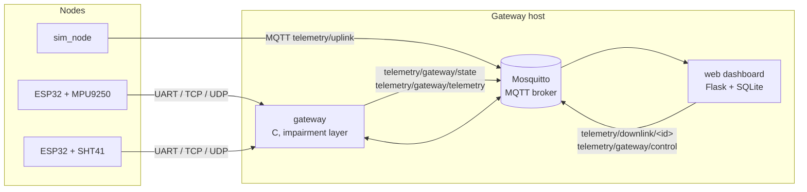

# Reliable Telemetry

A reliable telemetry channel for distributed sensor nodes. ESP32 nodes stream sensor data to a C gateway over
whichever link is available (UART, TCP or UDP), buffer locally when every link is down, and deliver critical events
with acknowledgement and retransmission. The gateway deduplicates and tracks every node, publishes its state over MQTT,
and a web dashboard shows live metrics, link quality and alarms.

The project also ships a channel impairment layer inside the gateway (loss, duplication, corruption, delay, jitter,
blackouts) so the reliability guarantees can be demonstrated and measured on real hardware.

## Features

- **Compact binary protocol**: 18-byte header, JSON payload up to 128 bytes, CRC-32 over every frame.
- **Swappable transports**: the same protocol logic runs over UART, TCP, UDP and MQTT. Nodes pick the best link
  automatically (UART > TCP > UDP) and fail over without losing sequence continuity.
- **Store-and-forward**: nodes buffer telemetry while no link is alive and flush it in order once a link returns.
  Critical messages wait in a separate queue and are never evicted by telemetry.
- **At-least-once delivery for critical messages**: ALARM and CONFIG frames are acknowledged and retried
  (2 s timeout, 3 retries) with byte-identical retransmissions.
- **Loss, duplicate and reordering detection**: per-node sliding window over sequence numbers; duplicates never
  create a second event, late packets are accounted for correctly.
- **Zero-touch provisioning**: a board plugged into the gateway over UART receives its node id, Wi-Fi credentials
  and gateway address automatically and can then work over Wi-Fi alone.
- **Link quality metrics**: online/offline state, loss rate, round-trip latency, node-side buffer backlog.
- **Honest time axis**: the gateway reconstructs when each sample was actually measured, so telemetry that was buffered
  during an outage lands at its true time on the charts and the gap visibly fills in after the link returns.
- **Channel impairment simulator**: built-in profiles (`good`, `lossy20`, `delay`, `flaky`), timed blackouts,
  per-node targeting and reproducible runs via a seed, all controllable from the dashboard.
- **Web dashboard**: live node cards, KPIs, time-series charts backed by SQLite, alarm log, remote commands.

## Architecture



The gateway is the single source of truth: it validates frames, tracks sequence numbers, sends ACKs over the same
link a frame arrived on, and publishes its processed state. The web application only renders that state and stores
sensor samples; it never recomputes delivery statistics on its own.

## Repository layout

| Path | Contents |
|---|---|
| `protocol/` | Protocol codec (`protocol.c`) and ACK/retry state machine (`reliability.c`), shared by every component |
| `gateway/` | Gateway daemon: UDP/TCP/UART/MQTT front ends, node tracking, provisioning, impairment layer |
| `node_common/` | Shared ESP32 firmware core (`node_common.h`), packet queue, sketch sync script, sensor bring-up sketches |
| `node_accelerometer/` | Arduino sketch for an MPU9250 node (roll/pitch/yaw) |
| `node_sht41/` | Arduino sketch for an SHT41 node (temperature/humidity) |
| `sim_node/` | Simulated node over MQTT with configurable loss and duplication |
| `web/` | Flask dashboard, REST API and Python protocol codec |
| `tests/` | Unit tests for the codec, the reliability state machine and the packet queue |

## Getting started

### Prerequisites

Gateway host (Raspberry Pi OS / Debian / Ubuntu):

```bash
sudo apt install build-essential libmosquitto-dev libcjson-dev mosquitto python3-venv
```

macOS (development; Wi-Fi credentials for provisioning must be listed in `gateway.conf`, since there is no `nmcli`):

```bash
brew install mosquitto cjson
```

Firmware: Arduino IDE with the ESP32 board package. The MPU9250 sketch also needs the **MPU9250** library by
*hideakitai*; the SHT41 sketch has no extra dependencies.

### Build and test

```bash
make            # builds gateway/gateway and sim_node/sim_node
make test       # unit tests, Python codec cross-check, firmware copy check
```

### Run the stack

```bash
# 1. MQTT broker (listens on all interfaces, anonymous access)
mosquitto -c mosquitto_open.conf

# 2. Gateway (run from gateway/ so it finds gateway.conf and writes its log and node registry there)
cd gateway && ./gateway

# 3. Web dashboard
python3 -m venv .venv && .venv/bin/pip install -r web/requirements.txt
cd web && WEB_HOST=0.0.0.0 ../.venv/bin/python app.py 127.0.0.1
```

Open `http://<gateway-ip>:8080`. To see data without hardware, start one or more simulated nodes:

```bash
sim_node/sim_node --node-id 101
sim_node/sim_node --node-id 102 --loss-percent 20 --send-alarm
```

### Flash the nodes

1. Open `node_accelerometer/node_accelerometer.ino` or `node_sht41/node_sht41.ino` in Arduino IDE and upload it.
2. With the gateway running, connect the board to the gateway host with a USB cable. The gateway detects the port,
   assigns a node id (lowest free id, stable per MAC address) and sends the Wi-Fi credentials and its own address.
3. The board stores the settings in NVS. From then on it keeps Wi-Fi as a backup link and can run without the cable.

If you edit `node_common/` or `protocol/`, run `node_common/sync.sh` to refresh the copies inside the sketch folders
(Arduino IDE only compiles files that live next to the sketch).

## Configuration

### Gateway

| Setting | Where | Default |
|---|---|---|
| UDP / TCP ports | `UDP_PORT`, `TCP_PORT` in `gateway.c` | 5005 / 5006 |
| MQTT broker | `MQTT_HOST`, `MQTT_PORT` in `gateway.c` | 127.0.0.1:1883 |
| Serial ports to scan | `GATEWAY_UART` environment variable (glob) | `/dev/ttyUSB*`, `/dev/ttyACM*` |
| Wi-Fi credentials for provisioning | `gateway/gateway.conf` (see `gateway.conf.example`) | detected via `nmcli` |

`gateway.conf` and the node registry (`node_registry.txt`) are ignored by git. Delete the registry to restart node
numbering.

### Web dashboard

`app.py [broker_host] [broker_port]` plus environment variables:

| Variable | Default | Meaning |
|---|---|---|
| `WEB_HOST` | `127.0.0.1` | Bind address; use `0.0.0.0` to expose the dashboard on the LAN |
| `WEB_PORT` | `8080` | HTTP port |
| `TELEMETRY_DB` | `web/telemetry.db` | SQLite database for samples and alarms |
| `RETENTION_HOURS` | `24` | How long samples are kept |

### Firmware

Compile-time options at the top of `node_common/node_common.h`:

| Option | Default | Meaning |
|---|---|---|
| `LINK_VIA_USB_CABLE` | `1` | Use the board's USB serial as the wired link. Set to `0` to use UART2 on GPIO16 (RX) / GPIO17 (TX) and keep USB serial for logs and console commands (`alarm`, `status`, `forget`) |
| `SERVO_ENABLED` | `false` | Drive a servo on `SERVO_PIN` (GPIO18, requires the ESP32Servo library) |
| `BUFFER_CAPACITY` | `50` | Telemetry packets buffered while offline (oldest dropped on overflow) |
| `ALARM_QUEUE_CAP` | `8` | Critical messages waiting for a link |

## Protocol

All multi-byte fields are little-endian. A frame is the header, the payload, then a CRC-32 (IEEE 802.3, same as
`zlib.crc32`) computed over header and payload.

| Offset | Size | Field | Notes |
|---|---|---|---|
| 0 | 1 | `version` | currently `1` |
| 1 | 1 | `msg_type` | see below |
| 2 | 2 | `node_id` | `0` is reserved for HELLO and broadcast |
| 4 | 4 | `sequence` | one counter per node, shared by all message types |
| 8 | 8 | `timestamp_ms` | node uptime in milliseconds |
| 16 | 2 | `payload_len` | 0..128 |
| 18 | n | `payload` | UTF-8 JSON |
| 18 + n | 4 | `crc32` | |

| Type | Value | Delivery |
|---|---|---|
| `HEARTBEAT` | 0 | best effort; with `node_id = 0` it is a HELLO carrying `{"mac": ..., "id": ...}` |
| `TELEMETRY` | 1 | best effort, buffered on the node while offline |
| `ALARM` | 2 | acknowledged, retried |
| `CONFIG` | 3 | acknowledged, retried |
| `ACK` | 4 | echoes the sequence number of the acknowledged frame |

Stream transports (UART, TCP) are framed by the header itself: the receiver resynchronises byte by byte on a
plausible header (`version`, `msg_type`, `payload_len`) and validates the CRC. UDP and MQTT carry one frame per
datagram/message.

### Gateway to node commands

`CONFIG` frames with a JSON payload: `{"cmd":"id"}` (node id assignment), `wifi`, `gw` (provisioning), `ping`
(latency probe), `servo`, `fire_alarm` (ask the node to raise its own ALARM), `simulate_loss`. An `ALARM` frame with
`{"cmd":"alarm","active":true|false}` toggles the remote alarm indicator on the node.

### MQTT topics

| Topic | Direction | Format |
|---|---|---|
| `telemetry/uplink` | MQTT nodes → gateway | binary frame |
| `telemetry/downlink/<node_id>` | gateway / web → node | binary frame |
| `telemetry/gateway/state` | gateway → web, every 2 s | JSON: per-node counters, latency, backlog, impairment state |
| `telemetry/gateway/telemetry` | gateway → web, per accepted packet | JSON: header fields, decoded payload and `age_ms` (how long ago the sample was measured) |
| `telemetry/gateway/control` | web → gateway | JSON: `{"cmd":"impair", "profile", "loss", "dup", "corrupt", "delay_ms", "jitter_ms", "node", "seed", "blackout_s"}` |

## Web API

| Method | Endpoint | Purpose |
|---|---|---|
| GET | `/api/state` | Node list, counters, impairment and broker status |
| GET | `/api/metrics` | Metric names available per node |
| GET | `/api/history?node_id=&metric=&since_s=` | Time series for a chart |
| GET | `/api/events` | Recent alarms |
| POST | `/api/impairment` | Apply a profile, custom parameters or a blackout |
| POST | `/api/node-alarm/<node_id>` | Ask a node to raise an ALARM |
| POST | `/api/alarm/<node_id>`, `/api/alarm/all` | Toggle the remote alarm on nodes |
| POST | `/api/simulate-loss/<node_id>` | Enable outbound packet loss on the node itself |
| POST | `/api/config/broker` | Switch the MQTT broker the dashboard listens to |

## Channel impairment

The impairment layer sits at the gateway's single entry and exit points, so it affects every transport in both
directions.

| Profile | Loss | Duplicates | Corruption | Delay |
|---|---|---|---|---|
| `good` | 0 | 0 | 0 | 0 |
| `lossy20` | 20% | 0 | 0 | 0 |
| `delay` | 0 | 0 | 0 | 200 ms + 0..100 ms jitter |
| `flaky` | 10% | 10% | 5% | 100 ms + 0..300 ms jitter (causes reordering) |

A blackout drops all traffic for N seconds. When it targets all nodes it also stops the gateway's UART keep-alive, so
wired nodes switch to buffering exactly as they would after a real disconnect. Other profiles act on the gateway side
only: a node on a healthy wire does not notice the loss and does not buffer.

## Known limitations

- Integrity is protected by CRC-32 only; frames are not authenticated and there is no replay protection.
- The bundled Mosquitto configuration allows anonymous access on all interfaces. Wi-Fi credentials are sent to
  nodes over the serial link and stored in NVS in plain text.
- Buffered telemetry is fire-and-forget once a link accepts it; only critical messages are acknowledged.
- The node buffer lives in RAM and does not survive a reboot.
- Each node has at most one critical message in flight; others wait in the queue.
- Loss rate on the dashboard is cumulative since the gateway started.
- Latency is measured as round-trip time; one-way delay and jitter are not reported.
- Sample times are reconstructed from node uptime with a minimum-delay filter (accurate to tens of milliseconds while the
  node has been seen online since boot); samples that arrive only after a gateway restart cannot be placed precisely.
- The gateway tracks up to 10 nodes, 4 TCP clients and 4 serial ports.
