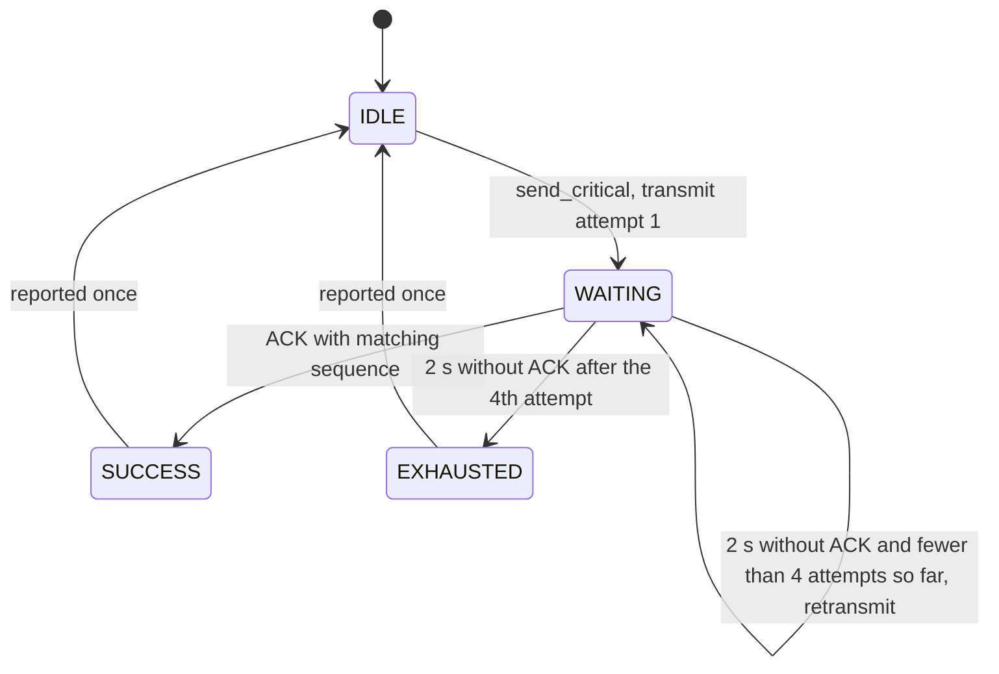
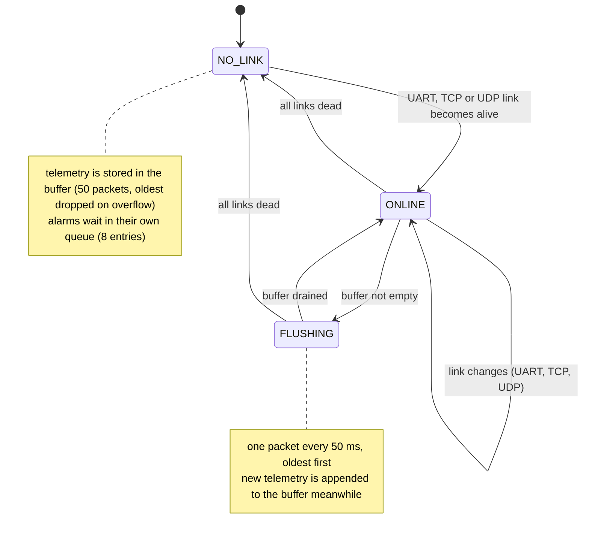
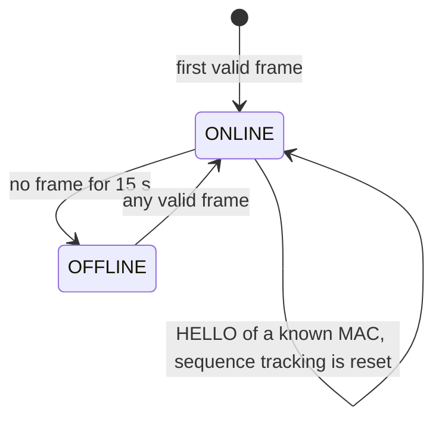
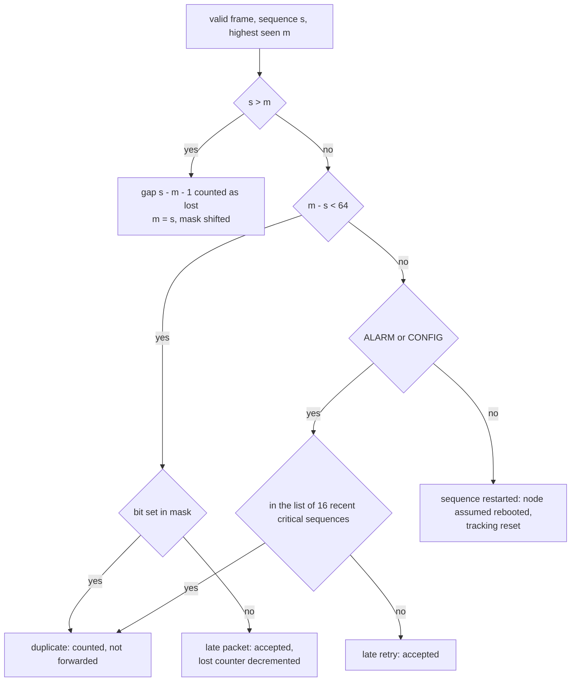

# Protocol specification

Version 1. This document describes the wire format, the node and gateway state machines and the reliability rules. The
source of truth is [`protocol/protocol.c`](../protocol/protocol.c), [`protocol/reliability.c`](../protocol/reliability.c),
[`node/_shared/node_common.h`](../node/_shared/node_common.h) and [`gateway/gateway.c`](../gateway/gateway.c).

## Frame format

All multi-byte fields are little-endian (ESP32, ARM and x86 hosts all are, so no byte swapping is done).

| Offset | Size | Field | Notes |
|---|---|---|---|
| 0 | 1 | `version` | `1`; `unpack` rejects any other value, and stream receivers use it as part of the frame start marker |
| 1 | 1 | `msg_type` | `0`..`4`, see below |
| 2 | 2 | `node_id` | `0` is reserved for HELLO and for broadcast from the gateway |
| 4 | 4 | `sequence` | one counter per node, shared by all message types, starts at 0 after a reboot |
| 8 | 8 | `timestamp_ms` | node uptime in milliseconds (not wall-clock time) |
| 16 | 2 | `payload_len` | 0 to 128 |
| 18 | n | `payload` | UTF-8 JSON object |
| 18 + n | 4 | `crc32` | CRC-32 (IEEE 802.3, as `zlib.crc32`) over header and payload |

Maximum frame size: 18 + 128 + 4 = 150 bytes.

| `msg_type` | Value | Direction | Delivery |
|---|---|---|---|
| `HEARTBEAT` | 0 | both | best effort. From a node with `node_id = 0` it is a HELLO: `{"mac": "...", "id": N}` (plus `"probe": 1` once the id is confirmed) |
| `TELEMETRY` | 1 | node to gateway | best effort, buffered on the node while no link is alive |
| `ALARM` | 2 | node to gateway; gateway to node (remote alarm indicator) | acknowledged and retried |
| `CONFIG` | 3 | gateway to node | acknowledged and retried |
| `ACK` | 4 | both | echoes the `sequence` of the frame it acknowledges; carries no payload |

`unpack` rejects a frame, in this order, when it is shorter than 22 bytes (`PROTO_ERR_TOO_SHORT`), when the CRC does not
match (`PROTO_ERR_BAD_CRC`), when `version` is not 1 (`PROTO_ERR_BAD_VERSION`), when `msg_type` is above 4
(`PROTO_ERR_UNKNOWN_TYPE`), when `payload_len` differs from the bytes actually present (`PROTO_ERR_LEN_MISMATCH`), or when
`payload_len` exceeds 128 (`PROTO_ERR_PAYLOAD_TOO_BIG`). It never reads outside the buffer.

### Framing on byte streams

UART and TCP carry a byte stream, so the receiver finds frame boundaries itself. It accumulates bytes and keeps a
candidate frame only while it is plausible (byte 0 equals the version, byte 1 is at most 4, `payload_len` is at most 128).
An implausible prefix is discarded one byte at a time, so garbage such as a bootloader banner or a connection that starts in
the middle of a frame costs at most one frame and does not desynchronise the stream.

The gateway's reader (`gateway/frame_reader.h`) also checks the CRC itself. When a candidate frame fails the check it drops
a single byte and rescans the bytes it already holds instead of discarding the whole buffer, so a frame with a damaged length
field, a truncated frame or a bit error costs only that frame and never the intact frames behind it. Each rejected candidate
is counted as a corrupted frame. On UART a pause of more than 100 ms inside an unfinished frame also resets the reader.
The node firmware's assembler for gateway-to-node frames still discards its buffer after a failed CRC; that traffic is sparse
and every critical frame is retried. UDP and MQTT carry exactly one frame per datagram or message.

## Commands carried in `CONFIG`

| `cmd` | Payload | Effect |
|---|---|---|
| `id` | `{"cmd":"id","mac":"...","id":N}` | gateway assigns `node_id` to the board with this MAC |
| `wifi` | `{"cmd":"wifi","s":"ssid","p":"password"}` | provisioning; the node stores it in NVS and acknowledges |
| `gw` | `{"cmd":"gw","ip":"...","udp":5005,"tcp":5006}` | provisioning of the gateway address |
| `ping` | `{"cmd":"ping"}` | the node answers with an `ACK` of the same sequence; the gateway measures round-trip time |
| `fire_alarm` | `{"cmd":"fire_alarm"}` | the node raises its own `ALARM` with the full ACK/retry procedure |
| `servo`, `simulate_loss` | see the firmware | handled by the node, not exposed in the dashboard |

## State machines

### Critical message delivery (`reliability.c`)

An `ALARM` or `CONFIG` frame is sent with the same bytes and the same `sequence` on every attempt. The timeout is 2 s and
there are 3 retries, so at most 4 transmissions.

When delivery is exhausted the node puts the alarm back at the head of its alarm queue and tries again after a 5 s cool-down,
so a critical event is never dropped in favour of telemetry. An ACK with an unexpected sequence is ignored.

### Node link and buffering

Link liveness:

| Link | Alive while | Notes |
|---|---|---|
| UART | a valid frame arrived from the gateway in the last 3 s | the gateway sends a keep-alive every second |
| TCP | the socket is connected **and** the gateway answered in the last 7 s | the node sends a HELLO probe every 2 s |
| UDP | Wi-Fi is up **and** the gateway answered in the last 7 s | probed the same way |

The best live link is used, in the order UART, TCP, UDP. "Connected" alone is not trusted for Wi-Fi links: a dead gateway
would swallow packets silently instead of letting the node buffer them. `sequence` is shared by all links, so a switch
shows up on the gateway only as a possible gap or duplicate, never as a restart.

### Node as seen by the gateway

### Sequence tracking and deduplication (gateway)

The gateway keeps, per node, the highest `sequence` seen and a 64-bit mask of the last 64 sequences.

Every `ALARM`/`CONFIG` is acknowledged, including duplicates, because the original ACK may have been lost. A duplicate is
logged as "deduplicated" and creates no second event. `ACK` frames from nodes are not part of the sequence accounting.

## Time of measurement

`timestamp_ms` is node uptime, not a clock. For each node the gateway tracks the minimum of (arrival time minus
`timestamp_ms`) since the node booted, relaxing it by 2 ms per packet to follow clock drift. Packets that waited in the
node's buffer arrive with a larger difference; the excess is published as `age_ms`, and the dashboard places the sample at
`now - age_ms`. The estimate starts from the first packet seen and is reset when the node restarts, so samples buffered
before the gateway ever saw a fresh packet from that node cannot be placed precisely.

## Node identification

A node has no compiled-in id. After boot it sends a HELLO with its MAC. The gateway answers with `CONFIG {"cmd":"id"}`,
giving the lowest free id and persisting the MAC to id mapping (`node_registry.txt`). The node stores the id in NVS and
sends no telemetry until it has an id (assigned now or stored in NVS). A node that holds an id different from the registry is told to overwrite it.
